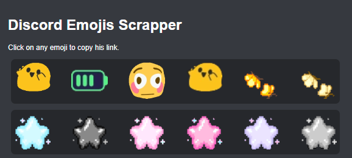

# Discord Emoji Scraper Chrome Extension

## Overview

The Discord Emoji Scraper Chrome Extension is a handy tool that allows you to easily collect and save Discord emojis from the current web page. Whether you're browsing forums, social media, or any website, you can quickly gather emojis for your personal collection or creative use.

## Features

- **Effortless Emoji Scraping:** With just a click, you can scrape all the emojis present on the current page, saving you time and effort.

- **Real-time Emoji Detection:** The extension scans the page in real-time to identify and capture both standard and custom Discord emojis.

- **Quick Access:** Access your collected emojis directly from the extension's popup. No need to leave the page you're on.

- **Download and Share:** Download your saved emojis. Share your collection with friends or use them for your creative projects.

- **Privacy Aware:** The extension operates locally and doesn't store any user data or information.

## How to Use

1. Install the extension from the Chrome Web Store.

2. Navigate to a web page containing Discord emojis.

3. Click on the extension icon in your Chrome toolbar.

4. Choose the emojis you want to collect by clicking on it.

## Installation

1. Clone this repository or download it as a ZIP file.

2. Open Google Chrome and go to `chrome://extensions/`.

3. Enable "Developer mode" using the toggle switch in the upper-right corner.

4. Click "Load unpacked" and select the folder containing the extension files.

5. The extension icon should appear in your Chrome toolbar.

## Contributing

Contributions are welcome! Feel free to fork this repository and submit pull requests. Please ensure that any changes align with the goals and design of the extension.

## License

This project is licensed under the [MIT License](LICENSE).

---

**Disclaimer:** This extension is developed independently and is not associated with or endorsed by Discord. It is intended for personal use and educational purposes only.
